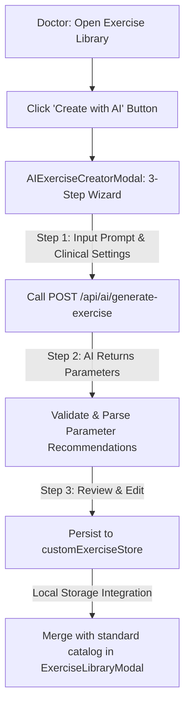

# Theralign Client — AI Components

This directory houses the patient-facing components that interface with Theralign's AI clinical triage and analysis services. AI operations are powered by the Groq Llama 3.1 8B model via structured backend endpoints.

---

## Directory Components

### 1. `SymptomSearchBox.jsx`
* **Purpose**: Allows patients to input their clinical symptoms in natural language (min 5 characters, max 500 characters) to receive specialization recommendations.
* **Workflow**:
  1. Captures patient input and invokes `interpretSymptomsAPI(symptoms)` (which calls `POST /api/ai/interpret-symptoms`).
  2. Receives a structured JSON payload detailing the suggested clinical specialization (e.g., *Sports Physiotherapy*), a confidence score, and a clinical explanation.
  3. Displays a summary card or permits deep-linking search queries to doctor discovery list views.
* **Aesthetic System**: Warmed layout wrapper (`#FFF8F5`), 2px solid black borders, and heavy monospaced status badges. Focus states double the border-width to 3px to maintain the Swiss design language.

### 2. `AIRecommendationCard.jsx`
* **Purpose**: Displays the structured response generated by the AI symptom analyzer.
* **Layout & Visuals**:
  * Rendered dynamically below the query text-area.
  * Bordered warning amber container with high-contrast text and a confidence indicator pill.
  * Action button `View [Specialization] Doctors →` deep-links patients directly to local providers matching the recommended triage specialization.

### 3. `LiveDoctorMap.jsx`
* **Purpose**: Renders the geospatial Leaflet map mapping verified practitioners within the patient's defined search radius (1km to 3500km/country-wide).
* **Integrations**: Connects to the doctor discovery listing API and triggers reactive map-marker updates upon viewport or filter modifications.

---

## AI Architecture & API Integration Layer (`client/src/api/ai.api.js`)

All client-to-server AI endpoints are routed through the Axios client:

* **Symptom Triage**: `interpretSymptomsAPI(symptoms)` -> `POST /api/ai/interpret-symptoms`
  * *Access*: Authenticated patients.
* **Doctor Profile Summaries**: `getDoctorAISummaryAPI(doctorId)` -> `GET /api/ai/doctor-summary/:doctorId`
  * *Access*: Public (lazy-generated if missing, cached on document records).
* **Batch Summaries**: `triggerBatchSummariesAPI()` -> `POST /api/ai/admin/batch-summaries`
  * *Access*: Verified Admin profiles.
* **Exercise Generation**: `generateExerciseAPI(data)` -> `POST /api/ai/generate-exercise`
  * *Access*: Verified Doctors only. Rate-limited at the middleware layer.

---

## Phase 16 AI Exercise Creation Architecture

To allow practitioners to build custom clinical exercise programs on the fly, Phase 16 introduced the **AI Custom Exercise Creator**:

### 1. `AIExerciseCreatorModal.jsx` (under `client/src/components/exercises/`)
A multi-step modal wizard designed for doctor workflows:
* **Step 1: Context Collection**: Captures natural language description (e.g., *“Gentle rotational shoulder stretch for rotator cuff tear”*), target muscle groups, specific patient conditions, and difficulty levels.
* **Step 2: Parameter Modeling**: Submits the request to the AI generator which prompts Llama 3.1 8B to model ideal clinical parameters: sets, reps, frequency, and duration.
* **Step 3: Clinical Review**: Displays the complete exercise with pre-filled inputs. Doctors can manually override titles, instructions, video URLs, and sets/reps parameters before finalized saving.

### 2. Client-Side Persistence (`client/src/utils/customExerciseStore.js`)
* Custom-created exercises are managed via `customExerciseStore.js` using browser `localStorage` under the key `'theralign_custom_exercises'`.
* This decouples draft creation from permanent server records, keeping therapist sandboxes isolated.

### 3. Catalog Integration & Deletion UX (`client/src/components/exercises/ExerciseLibraryModal.jsx`)
* Custom exercises are dynamically merged with the static 50+ item catalog upon modal load.
* Merged items are labeled with a high-contrast `CUSTOM / AI` badge.
* Custom cards listen for hover state changes (`hoveredExerciseId`) and display a subtle deletion cross `×` in the top right, allowing therapists to easily purge customized entries.

---

## Security & Rate Limiting Controls
* **Backend Guard (`aiRateLimit.middleware.js`)**: Restricts AI exercise generation to a maximum of **10 requests per minute** per doctor, preventing API exhaustion.
* **Access Control**: Enforces validation check constraints. Attempts to hit AI endpoints from unauthorized user accounts return a `403 Forbidden` response.
